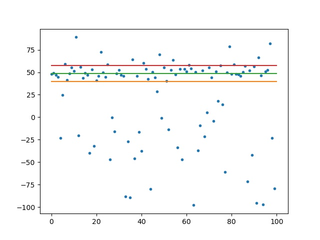
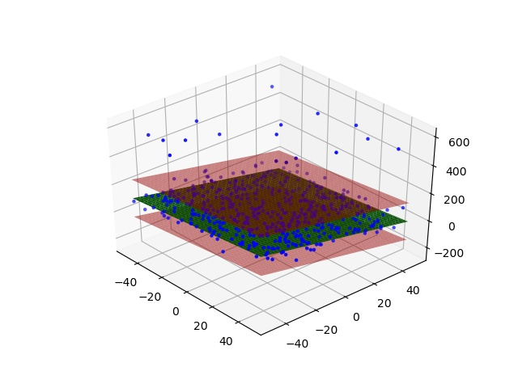

# Robust Gaussian Fitting Library

A Library for Robust Gaussian Fitting using geometric models in presence of outliers. Currently, this library support only two core algorithms, FLKOS for finding the average of Gaussian, and MSSE for finding the scales. The intention is to provide more methods and convenient solutions.

## Prior knowledge: Rough estimate of structure size
In this robust model fitting method, the main assumption is that, the Gaussian we are looking for, has the majority of data points. If it doesn't, this turns the problem into a clustering problem. If the structure does not have the majority of data and the outliers do not form a structure, this reduces the problem back to segmentation where the structure size is smaller than half of data. 

If the structure size cannot be guessed, you can follow MCNC which uses covariance of data points to sample from structure density. However, if that seems hard to implement, you can just run the method with many structure sizes and fuse the models by taking Median of them. IMHO these are the most efficient and yet accurate methods.

## Usage from Python
You can install this library via pip.
```
pip3 install RobustGaussianFittingLibrary
```

### importable libraries ###
* __from RobustGaussianFittingLibrary import__: Basic functions can be found here for 1D and 2D data. Also for Tensors.
	* MSSE : Given set of residuals, it finds the scale of a Gaussian (Reference :Robust segmentation of visual data using ranked unbiased scale estimate, A. Bab-Hadiashar and D. Suter)
	* fitValue : Given a vector, it finds average and standard deviation of the Gaussian.
	
	
	* fitValue2Skewed : Given a vector (and weights are accepted too), it finds the mode by (Median of inliers) and reports it along with a scale which is the distance of the mode from the edges of the Gaussian (by 3 STDs) divided by 3.
	* fitValueTensor : Given a tensor of size n_F, n_R, n_C, it finds the Gaussian mean and std for each pixel in n_R and n_C.
	* fitLine : Given vectors X and Y, it finds three parameters describing a line by slope, intercept and scale of noise.
	
	
	* fitLineTensor : Given a tensor, it fits a line for each pixel.
	* fitPlane : Given an image, returns four parameters of for algebraic fitting of a plane.
	
	
	* fitBackground : Given an image, returns the mean and std of background at each pixel.
	* fitBackgroundTensor : Given a tensor of images n_F x n_R x n_C, returns the background mean and std for each pixel for each frame in n_F.

* __useMultiproc__: In this set, the tensor oporations are run by python Multiprocessing.
	* fitValueTensor_MultiProc : Does fitValueTensor using multiprocessing
	* fitLineTensor_MultiProc : Does fitLineTensor using multiprocessing
	* fitBackgroundTensor_multiproc : Does fitBackgroundTensor using multiprocessing

### Examples in Python ###
Many test functions are availble in the tests.py script. in the script, look for the main function and choose one of them to run. 

* Fitting a single value to a vector of data
```
import RobustGaussianFittingLibrary 
import numpy as np
inliers = np.random.randn(30)
outliers = np.array([10, 20, 1000])
inVec = np.random.shuffle(np.hstack((inliers, outliers)))
print(RobustGaussianFittingLibrary.fitValue(inVec))
```

## Compilation into static and shared library
Run the following command to generate a shared .so library:
```
make
```
The python wrapper will be looking for the .so shared library file. The wrapper is in the file cWrapper.py and is used by other python files.
**Note**: if you are using windows, you can use mingwin and it has a make in its bin folder with a different name. Copy it and rename it to make. Also you would need rm from coreutils for windows.

To test the shared library, simply type in:
```
make test
```

## Usage from MATLAB ##
Currently, only the fitValue funciton is supported by a mex C code for MATLAB. However, you can request for more, or implement it yourself accordingly. Look at the RGFLib_mex_fitValue2Skewed_Test.m file

# Credits
This library is an effort to implement a set of robsut statistical functions. However, part of the core of the RGFLib.c, (MSSE) was implemented as part of the package [RobustPeakFinder](https://github.com/MarjanHJ/RobustPeakFinder) for crystallography data analysis in 2017 under free license in LaTrobe University Australia. Afterwards, since robust Gaussian fitting can solve many problems, we put them all together into the current library in CFEL/DESY Hamburg. The RPF project now imports this library as it well serves the purpose of that project.

## Authors
* Alireza Sadri <Alireza[Dot]Sadri[At]desy[Dot]de>
* Marjan Hadian Jazi  <M[Dot]HadianJazi[At]latrobe[Dot]edu[Dot]au>
